# al-folio

**A simple, clean, and responsive [Jekyll](https://jekyllrb.com/) theme for academics.**

---

## User community

The vibrant community of **al-folio** users is growing!
Academics around the world use this theme for their homepages, blogs, lab pages, as well as webpages for courses, workshops, conferences, meetups, and more.
Check out the community webpages below.
Feel free to add your own page(s) by sending a PR.

<table>
<tr>
<td>Academics</td>
<td>
<a href="https://pranavraj575.github.io" target="_blank">★</a>
<a href="https://martinbulla.github.io" target="_blank">★</a>
<a href="https://maruan.alshedivat.com" target="_blank">★</a>
<a href="https://www.cs.columbia.edu/~chen1ru/" target="_blank">★</a>
<a href="https://maithraraghu.com" target="_blank">★</a>
<a href="https://platanios.org" target="_blank">★</a>
<a href="https://otiliastr.github.io" target="_blank">★</a>
<a href="https://www.maths.dur.ac.uk/~sxwc62/" target="_blank">★</a>
<a href="https://mayankm96.github.io/" target="_blank">★</a>
<a href="https://markdean.info/" target="_blank">★</a>
<a href="https://kakodkar.github.io/" target="_blank">★</a>
<a href="https://sahirbhatnagar.com/" target="_blank">★</a>
<a href="https://spd.gr/" target="_blank">★</a>
<a href="https://jay-sarkar.github.io/" target="_blank">★</a>
<a href="https://aborowska.github.io/" target="_blank">★</a>
<a href="https://aditisgh.github.io/" target="_blank">★</a>
<a href="https://alexhaydock.co.uk/" target="_blank">★</a>
<a href="https://alixkeener.net/" target="_blank">★</a>
<a href="https://andreea7b.github.io/" target="_blank">★</a>
<a href="https://rishabhjoshi.github.io/" target="_blank">★</a>
<a href="https://sheelabhadra.github.io/" target="_blank">★</a>
<a href="https://giograno.com/" target="_blank">★</a>
<a href="https://immsrini.github.io/" target="_blank">★</a>
<a href="https://apooladian.github.io/" target="_blank">★</a>
<a href="https://chinmoy-dutta.github.io/" target="_blank">★</a>
<a href="https://liamcli.com/" target="_blank">★</a>
<a href="https://yoonholee.com/" target="_blank">★</a>
<a href="https://abstractgeek.github.io/" target="_blank">★</a>
<a href="https://www.compphys.de/" target="_blank">★</a>
<a href="https://julianstreyczek.github.io" target="_blank">★</a>
<a href="https://sdaza.com" target="_blank">★</a>
<a href="https://niweera.com/" target="_blank">★</a>
<a href="https://www.alihkw.com" target="_blank">★</a>
<a href="https://amirpourmand.ir" target="_blank">★</a>
<a href="https://scottleechua.github.io" target="_blank">★</a>
<a href="https://sk1y101.github.io" target="_blank">★</a>
<a href="https://yyang768osu.github.io" target="_blank">★</a>
<a href="https://veedata.github.io" target="_blank">★</a>
<a href="https://K-Wu.github.io" target="_blank">★</a>
<a href="https://amalawilson.com" target="_blank">★</a>
<a href="https://tirtharajdash.github.io" target="_blank">★</a>
<a href="https://carolinacarreira.github.io" target="_blank">★</a>
<a href="https://manandey.github.io" target="_blank">★</a>
<a href="https://johanneshoerner.github.io" target="_blank">★</a>
<a href="https://ioannismavromatis.com" target="_blank">★</a>
<a href="https://taidnguyen.github.io" target="_blank">★</a>
<a href="https://lbugnon.github.io" target="_blank">★</a>
<a href="https://joahannes.github.io" target="_blank">★</a>
<a href="https://dominikstrb.github.io" target="_blank">★</a>
<a href="https://tylerbarna.com" target="_blank">★</a>
<a href="https://daviddmc.github.io/" target="_blank">★</a>
<a href="https://andreaskuster.ch/" target="_blank">★</a>
<a href="https://ellisbrown.github.io/" target="_blank">★</a>
<a href="https://djherron.github.io/" target="_blank">★</a>
<a href="https://rodosingh.github.io/" target="_blank">★</a>
<a href="https://vdivakar.github.io/" target="_blank">★</a>
<a href="https://george-gca.github.io/" target="_blank">★</a>
<a href="https://bashirkazimi.github.io/" target="_blank">★</a>
<a href="https://dohaison.github.io/" target="_blank">★</a>
<a href="https://raphaaal.github.io/" target="_blank">★</a>
<a href="https://varuniyer.info/" target="_blank">★</a>
<a href="https://yukimasano.github.io/" target="_blank">★</a>
<a href="https://hashe037.github.io/" target="_blank">★</a>
<a href="https://wang-boyu.github.io/" target="_blank">★</a>
<a href="https://qingqingchen.info" target="_blank">★</a>
<a href="https://bajinsheng.github.io/" target="_blank">★</a>
<a href="https://www.silviofanzon.com/" target="_blank">★</a>
<a href="https://kaikaiyao.github.io/" target="_blank">★</a>
<a href="https://lilyzhng.github.io/" target="_blank">★</a>
<a href="https://samadamday.com/" target="_blank">★</a>
<a href="https://fanpu.io/" target="_blank">★</a>
<a href="https://abigalekim.github.io/" target="_blank">★</a>
<a href="https://lucasresck.github.io/" target="_blank">★</a>
<a href="https://users.wpi.edu/~lfichera/" target="_blank">★</a>
<a href="https://anmspro.github.io/" target="_blank">★</a>
<a href="https://berlyne.net/" target="_blank">★</a>
<a href="https://filippomazzoli.github.io/" target="_blank">★</a>
<a href="https://www.escontrela.me/" target="_blank">★</a>
<a href="https://raffaem.github.io/" target="_blank">★</a>
<a href="https://cbueth.de/" target="_blank">★</a>
<a href="https://kyleaoman.github.io/" target="_blank">★</a>
<a href="https://decwest.github.io/" target="_blank">★</a>
<a href="https://www.jedburkat.com" target="_blank">★</a>
<a href="https://hrzhang.me" target="_blank">★</a>
<a href="https://kudhru.github.io/" target="_blank">★</a>
<a href="https://mbarbetti.github.io/" target="_blank">★</a>
<a href="https://www.zhivotenko.com/" target="_blank">★</a>
<a href="https://giordanodaloisio.github.io/" target="_blank">★</a>
<a href="https://aadityaura.github.io/" target="_blank">★</a>
<a href="https://roydipta.com/" target="_blank">★</a>
<a href="https://astanziola.github.io" target="_blank">★</a>
<a href="https://tinkerer.in" target="_blank">★</a>
<a href="https://afraniomelo.github.io/en/" target="_blank">★</a>
<a href="https://jonaruthardt.github.io" target="_blank">★</a>
<a href="https://www.zla.app/" target="_blank">★</a>
<a href="https://stavros.github.io" target="_blank">★</a>
<a href="https://ericslyman.com" target="_blank">★</a>
<a href="https://ztjona.github.io/" target="_blank">★</a>
<a href="https://chrischoi314.github.io" target="_blank">★</a>
<a href="https://riccobelli.faculty.polimi.it" target="_blank">★</a>
<a href="https://kishan-ved.github.io/portfolio/" target="_blank">★</a>
<a href="https://abhilesh.github.io/" target="_blank">★</a>
<a href="https://jackjburnett.github.io/" target="_blank">★</a>
<a href="https://physics-morris.github.io/" target="_blank">★</a>
<a href="https://sraf.ir" target="_blank">★</a>
<a href="https://acad.garywei.dev/" target="_blank">★</a>
<a href="https://tonideleo.github.io/" target="_blank">★</a>
<a href="https://alonkellner.com/" target="_blank">★</a>
<a href="https://mingsun-kaust.github.io/" target="_blank">★</a>
<a href="https://hdocmsu.github.io/" target="_blank">★</a>
<a href="https://trandangtrungduc.github.io/" target="_blank">★</a>
<a href="https://mumarshahbaz.com/" target="_blank">★</a>
<a href="https://charlie-xiao.github.io/" target="_blank">★</a>
<a href="https://giuseppeperelli.github.io/" target="_blank">★</a>
<a href="https://shlee-lab.github.io/" target="_blank">★</a>
<a href="https://devos50.github.io/" target="_blank">★</a>
<a href="https://vmooers.github.io/" target="_blank">★</a>
<a href="https://jpfonseca.github.io/" target="_blank">★</a>
<a href="https://dmitryryumin.github.io/" target="_blank">★</a>
<a href="https://alexiglad.github.io/" target="_blank">★</a>
<a href="https://nishanthjkumar.com/" target="_blank">★</a>
<a href="https://joszuijderwijk.nl/" target="_blank">★</a>
<a href="https://d-jiao.github.io/" target="_blank">★</a>
<a href="https://cbuelt.github.io/" target="_blank">★</a>
<a href="https://mehrdad-noori.github.io/" target="_blank">★</a>
<a href="https://arthurclerjon.github.io/" target="_blank">★</a>
<a href="https://eilamshapira.com/" target="_blank">★</a>
<a href="https://freifrauvonbleifrei.github.io/" target="_blank">★</a>
<a href="https://thomasbourke1.github.io/" target="_blank">★</a>
<a href="https://siddharthsule.com/" target="_blank">★</a>
<a href="https://wenjiexu.site/" target="_blank">★</a>
<a href="https://zlatanajanovic.com/" target="_blank">★</a>
<a href="https://mchadolias.github.io/" target="_blank">★</a>
<a href="https://syanyong.github.io/" target="_blank">★</a>
<a href="https://jucheval.github.io/" target="_blank">★</a>
<a href="https://j1yoo.github.io/" target="_blank">★</a>
<a href="https://zhoji.github.io/" target="_blank">★</a>
<a href="https://smsnobin77.github.io/" target="_blank">★</a>
<a href="https://dongkyu-lee.info/" target="_blank">★</a>
<a href="https://laurajul.github.io/" target="_blank">★</a>
<a href="https://vud.org" target="_blank">★</a>
<a href="https://www.byeongsc.com/" target="_blank">★</a>
<a href="https://deden.id/" target="_blank">★</a>
</td>
</tr>
<tr>
<td>Labs</td>
<td>
<a href="https://haylab.caltech.edu/" target="_blank">★</a>
<a href="https://sjkimlab.github.io/" target="_blank">★</a>
<a href="https://systemconsultantgroup.github.io/scg-folio/" target="_blank">★</a>
<a href="https://decisionlab.ucsf.edu/" target="_blank">★</a>
<a href="https://programming-group.com/" target="_blank">★</a>
<a href="https://sailing-lab.github.io/" target="_blank">★</a>
<a href="https://inbt.jhu.edu/epidiagnostics/" target="_blank">★</a>
<a href="https://www.nuesl.org/" target="_blank">★</a>
<a href="https://big-culture.github.io/" target="_blank">★</a>
<a href="https://martinbulla.github.io/bullab/" target="_blank">★</a>
<a href="https://gpforesteyes.github.io/" target="_blank">★</a>
<a href="https://kenji-fukushima-lab.github.io/" target="_blank">★</a>
</td>
</tr>
<tr>
<td>Courses</td>
<td>
CMU PGM (<a href="https://sailinglab.github.io/pgm-spring-2019/" target="_blank">S-19</a>)  
CMU DeepRL (<a href="https://cmudeeprl.github.io/403_website/" target="_blank">S-21</a>, <a href="https://cmudeeprl.github.io/703website_f21/" target="_blank">F-21</a>, <a href="https://cmudeeprl.github.io/403website_s22/" target="_blank">S-22</a>, <a href="https://cmudeeprl.github.io/703website_f22/" target="_blank">F-22</a>, <a href="https://cmudeeprl.github.io/403website_s23/" target="_blank">S-23</a>, <a href="https://cmudeeprl.github.io/703website_f23/" target="_blank">F-23</a>)  
CMU MMML (<a href="https://cmu-multicomp-lab.github.io/mmml-course/fall2020/" target="_blank">F-20</a>, <a href="https://cmu-multicomp-lab.github.io/mmml-course/fall2022/" target="_blank">F-22</a>)  
CMU AMMML (<a href="https://cmu-multicomp-lab.github.io/adv-mmml-course/spring2022/" target="_blank">S-22</a>, <a href="https://cmu-multicomp-lab.github.io/adv-mmml-course/spring2023/" target="_blank">S-23</a>)  
CMU ASI (<a href="https://cmu-multicomp-lab.github.io/asi-course/spring2023/" target="_blank">S-23</a>)  
CMU Distributed Systems (<a href="https://andrew.cmu.edu/course/15-440/" target="_blank">S-24</a>)
</td>
</tr>
<tr>
<td>Conferences & workshops</td>
<td>
ICLR Blog Post Track (<a href="https://iclr-blogposts.github.io/2023/" target="_blank">2023</a>, <a href="https://iclr-blogposts.github.io/2024/about" target="_blank">2024</a>)  
ML Retrospectives (NeurIPS: <a href="https://ml-retrospectives.github.io/neurips2019/" target="_blank">2019</a>, <a href="https://ml-retrospectives.github.io/neurips2020/" target="_blank">2020</a>; ICML: <a href="https://ml-retrospectives.github.io/icml2020/" target="_blank">2020</a>)  
HAMLETS (NeurIPS: <a href="https://hamlets-workshop.github.io/" target="_blank">2020</a>)  
ICBINB (NeurIPS: <a href="https://i-cant-believe-its-not-better.github.io/" target="_blank">2020</a>, <a href="https://i-cant-believe-its-not-better.github.io/neurips2021/" target="_blank">2021</a>)  
Neural Compression (ICLR: <a href="https://neuralcompression.github.io/" target="_blank">2021</a>)  
Score Based Methods (NeurIPS: <a href="https://score-based-methods-workshop.github.io/" target="_blank">2022</a>) 
Images2Symbols (CogSci: <a href="https://images2symbols.github.io/" target="_blank"> 2022</a>)  
Medical Robotics Junior Faculty Forum (ISMR: <a href="https://junior-forum-ismr.github.io/" target="_blank"> 2023</a>) 
Beyond Vision: Physics meets AI (ICIAP: <a href="https://physicsmeetsai.github.io/beyond-vision/" target="_blank">2023</a>)  
Workshop on Diffusion Models (NeurIPS: <a href="https://diffusionworkshop.github.io/" target="_blank">2023</a>)  
Workshop on Structured Probabilistic Inference & Generative Modeling (ICML: <a href="https://spigmworkshop.github.io/" target="_blank">2023</a>, <a href="https://spigmworkshop2024.github.io/" target="_blank">2024</a>)  
Workshop on Foundation and Generative Models in Biometrics (<a href="https://foundgen-bio.github.io/iccv2025/" target="_blank">ICCV 2025</a>, <a href="https://foundgen-bio.github.io/cvpr2026/" target="_blank">CVPR 2026</a>)
</td>
</tr>
</table>

## Lighthouse PageSpeed Insights

### Desktop

Run the test yourself: [Google Lighthouse PageSpeed Insights](https://pagespeed.web.dev/report?url=https%3A%2F%2Falshedivat.github.io%2Fal-folio%2F&form_factor=desktop)

### Mobile

Run the test yourself: [Google Lighthouse PageSpeed Insights](https://pagespeed.web.dev/report?url=https%3A%2F%2Falshedivat.github.io%2Fal-folio%2F&form_factor=mobile)

## Table Of Contents

<!--ts-->

- [al-folio](#al-folio)
  - [User community](#user-community)
  - [Lighthouse PageSpeed Insights](#lighthouse-pagespeed-insights)
    - [Desktop](#desktop)
    - [Mobile](#mobile)
  - [Table Of Contents](#table-of-contents)
  - [Getting started](#getting-started)
  - [Installing and Deploying](#installing-and-deploying)
  - [Customizing](#customizing)
  - [Plugin Ecosystem](#plugin-ecosystem)
  - [Using AI Agents](#using-ai-agents)
    - [Codex](#codex)
    - [Claude](#claude)
    - [Copilot And Other Agents](#copilot-and-other-agents)
  - [Documentation](#documentation)
  - [Features](#features)
    - [Light/Dark Mode](#lightdark-mode)
    - [CV](#cv)
    - [People](#people)
    - [Publications](#publications)
    - [Collections](#collections)
    - [Layouts](#layouts)
      - [The iconic style of Distill](#the-iconic-style-of-distill)
      - [Full support for math &amp; code](#full-support-for-math--code)
      - [Photos, Audio, Video and more](#photos-audio-video-and-more)
    - [Other features](#other-features)
      - [GitHub's repositories and user stats](#githubs-repositories-and-user-stats)
      - [Theming](#theming)
      - [Social media previews](#social-media-previews)
      - [Atom (RSS-like) Feed](#atom-rss-like-feed)
      - [Related posts](#related-posts)
      - [Code quality checks](#code-quality-checks)
      - [GDPR Cookie Consent Dialog](#gdpr-cookie-consent-dialog)
  - [FAQ](#faq)
  - [Contributing](#contributing)
    - [Maintainers](#maintainers)
    - [All Contributors](#all-contributors)
  - [Star History](#star-history)
  - [License](#license)

<!--te-->

## Getting started

**⚠️ Important: Use "Use this template" (not fork)**

When creating your own website with al-folio, you have two options:

- ✅ **Recommended:** Click "[Use this template](https://github.com/new?template_name=al-folio&template_owner=alshedivat)" – This creates a clean copy that is independent from the main al-folio repository. Changes you make to your site won't be accidentally submitted to al-folio as pull requests.
- ❌ **Not recommended:** Forking the repository – This keeps a link to the main al-folio repo, making it easy to accidentally submit your personal site changes as contributions to our project.

**If you already forked:** Don't worry! You can still work with your fork normally. Just make sure to:

1. Make changes on a dedicated branch (e.g., `my-site-updates`)
2. When pushing changes, always verify you're pushing to **your own repository**, not the main al-folio repository
3. Never create pull requests to `alshedivat/al-folio` unless you're intentionally contributing improvements that benefit all users

For quick setup, see [docs/QUICKSTART.md](docs/QUICKSTART.md).

Want to learn more about Jekyll? Check out [this tutorial](https://www.taniarascia.com/make-a-static-website-with-jekyll/). Why Jekyll? Read [Andrej Karpathy's blog post](https://karpathy.github.io/2014/07/01/switching-to-jekyll/)! Why write a blog? Read [Rachel Thomas blog post](https://medium.com/@racheltho/why-you-yes-you-should-blog-7d2544ac1045).

## Installing and Deploying

For installation and deployment details please refer to [docs/INSTALL.md](docs/INSTALL.md).

## Customizing

For customization details please refer to [docs/CUSTOMIZE.md](docs/CUSTOMIZE.md).

## Plugin Ecosystem

`al-folio` is a thin starter in `v1.x`. Runtime features are plugin-owned and published as Ruby gems.

- Ownership boundaries: [docs/BOUNDARIES.md](docs/BOUNDARIES.md)
- Plugin catalog metadata: [`_data/featured_plugins.yml`](_data/featured_plugins.yml)
- Plugin catalog page source: [`_pages/plugins.md`](_pages/plugins.md)

Naming convention:

- Theme-coupled plugins use `al-folio-<feature>` repos and `al_folio_<feature>` gem/plugin ids.
- Reusable plugins can use `al-<feature>` or neutral naming.

Featured plugins and bundled starter plugins are different tracks. Bundling requires explicit updates to [Gemfile](Gemfile) and [\_config.yml](_config.yml).
Plugin-owned changes should be made in the owning `al-org-dev` plugin repository, not by copying runtime assets into this starter.
The bundled v1 plugin repos are:

- [`al-folio-core`](https://github.com/al-org-dev/al-folio-core): shared layouts, includes, style/runtime primitives, and upgrade contracts
- [`al-folio-cv`](https://github.com/al-org-dev/al-folio-cv): CV rendering
- [`al-folio-distill`](https://github.com/al-org-dev/al-folio-distill): Distill layouts and runtime assets
- [`al-folio-bootstrap-compat`](https://github.com/al-org-dev/al-folio-bootstrap-compat): temporary Bootstrap compatibility runtime
- [`al-folio-upgrade`](https://github.com/al-org-dev/al-folio-upgrade): v1 upgrade audit/report/codemods
- [`al-icons`](https://github.com/al-org-dev/al-icons): icon loading
- [`al-search`](https://github.com/al-org-dev/al-search): search runtime
- [`al-citations`](https://github.com/al-org-dev/al-citations): publication/citation helpers
- [`al-ext-posts`](https://github.com/al-org-dev/al-ext-posts): external post ingestion
- [`al-analytics`](https://github.com/al-org-dev/al-analytics), [`al-comments`](https://github.com/al-org-dev/al-comments), [`al-cookie`](https://github.com/al-org-dev/al-cookie), [`al-img-tools`](https://github.com/al-org-dev/al-img-tools), [`al-math`](https://github.com/al-org-dev/al-math), [`al-charts`](https://github.com/al-org-dev/al-charts), and [`al-newsletter`](https://github.com/al-org-dev/al-newsletter): feature-specific runtime and integration behavior

## Using AI Agents

`al-folio` v1.x is designed for agent-assisted setup and migration. Agents should read [AGENTS.md](AGENTS.md) first, then use [docs/BOUNDARIES.md](docs/BOUNDARIES.md) to route changes to the starter or the owning plugin repo.

For existing customized forks, the recommended migration path is to ask an agent to use the [al-folio v1 migration skill](.agents/skills/al-folio-v1-migration/SKILL.md). The skill walks through creating a disposable migration branch, bringing site-owned content/config/data onto the v1 starter contract, running `al_folio_upgrade`, auditing local overrides, and validating the build. This is preferred over a manual file-by-file upgrade because v1 runtime ownership moved into plugins and local overrides need explicit drift tracking.

The canonical skills live in [.agents/skills/](.agents/skills/). They are also exposed through `.codex/skills/` and `.claude/skills/` symlinks for agents that discover skills from tool-specific directories.

### Codex

Codex can use the repo-local skills:

- [al-folio bootstrap](.agents/skills/al-folio-bootstrap/SKILL.md): create and configure a new v1 site.
- [al-folio v1 migration](.agents/skills/al-folio-v1-migration/SKILL.md): migrate customized forks and audit local overrides.

Useful first prompts:

- "Use the al-folio bootstrap skill to configure my new site."
- "Use the al-folio v1 migration skill to migrate this customized fork and run the override audit."

### Claude

Claude should start from [CLAUDE.md](CLAUDE.md), which imports [AGENTS.md](AGENTS.md). For setup or migration tasks, use the matching skill from `.claude/skills/`, which points to the canonical `.agents/skills/` directory.

### Copilot And Other Agents

Copilot should follow [.github/copilot-instructions.md](.github/copilot-instructions.md) and the specialized agents in [.github/agents/](.github/agents/). Other agents should follow the same rule: keep starter work in this repo, route runtime behavior to the owning `al-org-dev` plugin, and run `bundle exec al-folio upgrade overrides audit` whenever local overrides are added or retained.

## Documentation

Comprehensive guides for all aspects of your al-folio website:

- **[Documentation index](docs/README.md)** – All user, maintainer, and migration guides
- **[Quick Start](docs/QUICKSTART.md)** – Get running in 5 minutes
- **[Installation & Deployment](docs/INSTALL.md)** – Set up your site on GitHub Pages or other platforms
- **[Customization Guide](docs/CUSTOMIZE.md)** – Personalize your website (CVs, publications, themes, etc.)
- **[Troubleshooting](docs/TROUBLESHOOTING.md)** – Fix common issues (deployment, build, styling, content)
- **[FAQ](docs/FAQ.md)** – Frequently asked questions and solutions
- **[Analytics](docs/ANALYTICS.md)** – Add website analytics and visitor tracking
- **[SEO Guide](docs/SEO.md)** – Optimize for search engines and improve discoverability
- **[Plugin Catalog](_pages/plugins.md)** – Featured and bundled plugin metadata

## Features

### Light/Dark Mode

This template has a built-in light/dark mode. It detects the user preferred color scheme and automatically switches to it. You can also manually switch between light and dark mode by clicking on the sun/moon icon in the top right corner of the page.

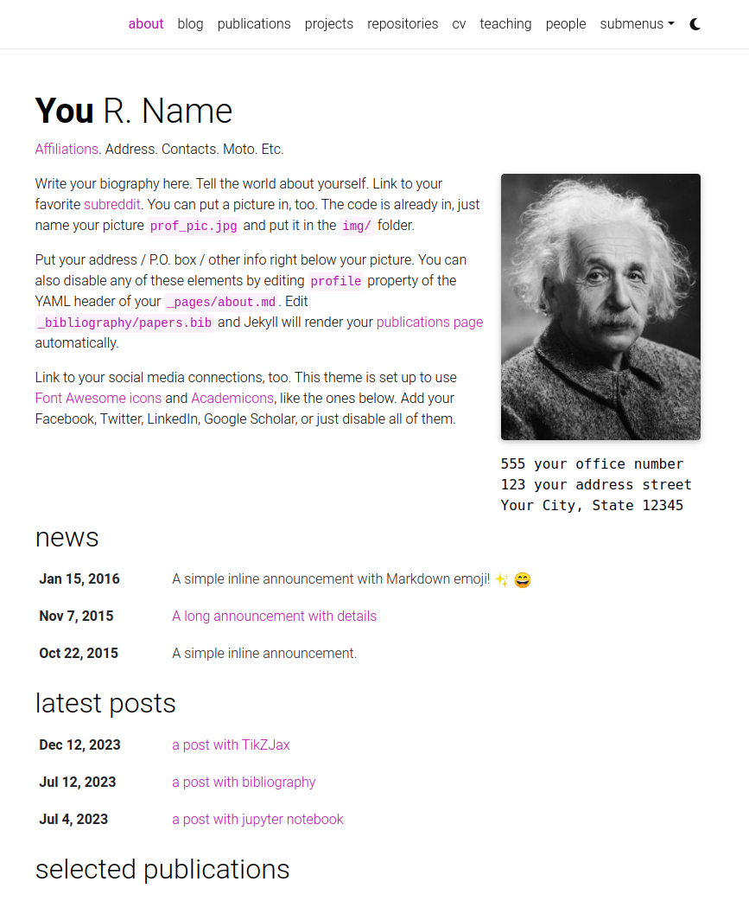
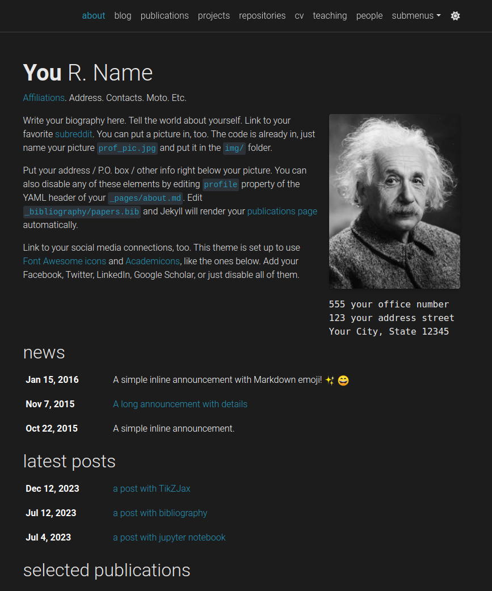

---

### CV

Your CV can be generated in one of two modern formats: **RenderCV** (recommended, with automatic PDF generation) or **JSONResume** (standardized JSON format). You can use both simultaneously and switch between them, or maintain just the one you prefer.

[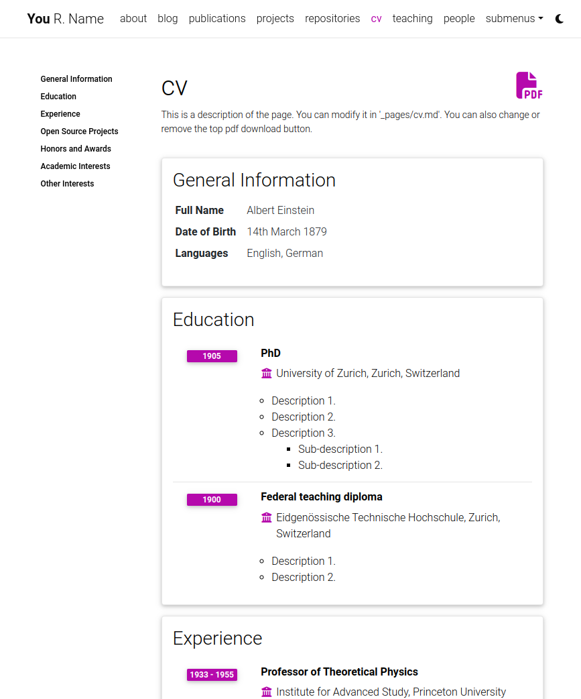](https://alshedivat.github.io/al-folio/cv/)

For setup and customization details, see [Modifying the CV information](docs/CUSTOMIZE.md#modifying-the-cv-information) in [docs/CUSTOMIZE.md](docs/CUSTOMIZE.md).

---

### People

You can create a people page if you want to feature more than one person. Each person can have its own short bio, profile picture, and you can also set if every person will appear at the same or opposite sides.

[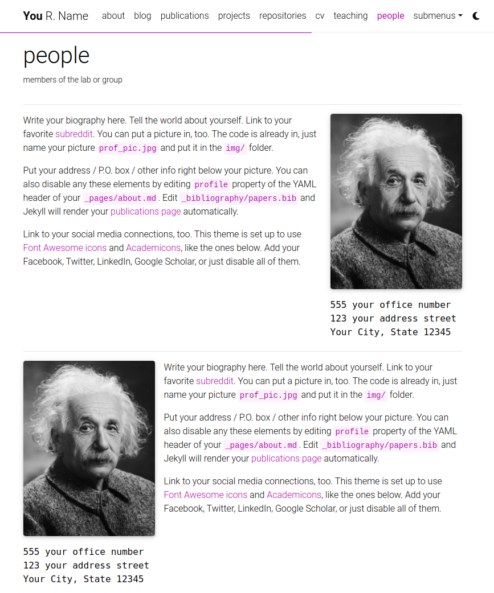](https://alshedivat.github.io/al-folio/people/)

---

### Publications

Your publications page is generated automatically from your BibTeX bibliography. You can customize publication display, add extra information like PDFs, and control sorting behavior.

[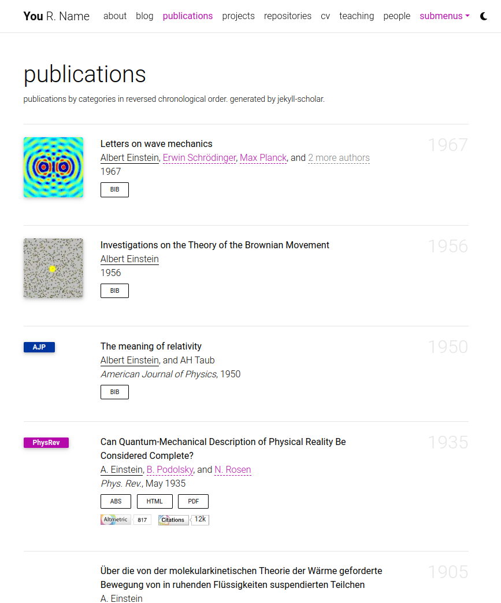](https://alshedivat.github.io/al-folio/publications/)

For setup, BibTeX field documentation, and customization options, see [Adding a new publication](docs/CUSTOMIZE.md#adding-a-new-publication) and [Managing publication display](docs/CUSTOMIZE.md#managing-publication-display) in [docs/CUSTOMIZE.md](docs/CUSTOMIZE.md).

---

### Collections

This Jekyll theme implements `collections` to organize content into categories. The theme comes with default collections for `news`, `projects`, `books`, and `teachings`. You can easily create your own collections for apps, stories, courses, or any other creative work.

[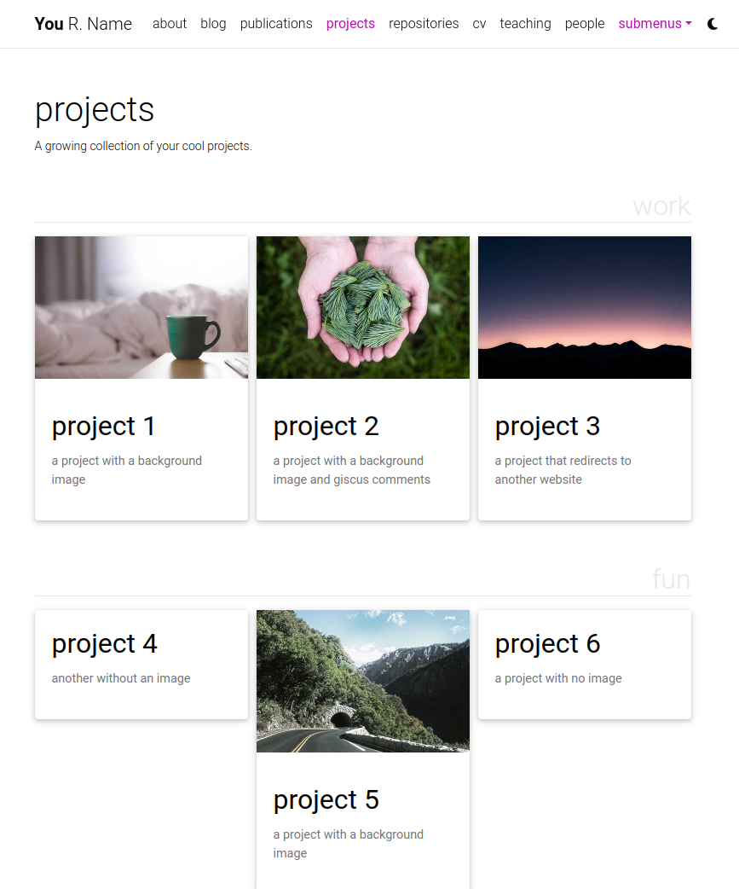](https://alshedivat.github.io/al-folio/projects/)

For detailed instructions on creating and customizing collections, see [Adding Collections](docs/CUSTOMIZE.md#adding-collections) in [docs/CUSTOMIZE.md](docs/CUSTOMIZE.md).

---

### Layouts

**al-folio** comes with stylish layouts for pages and blog posts.

#### The iconic style of Distill

The theme allows you to create blog posts in the [distill.pub](https://distill.pub/) style:

[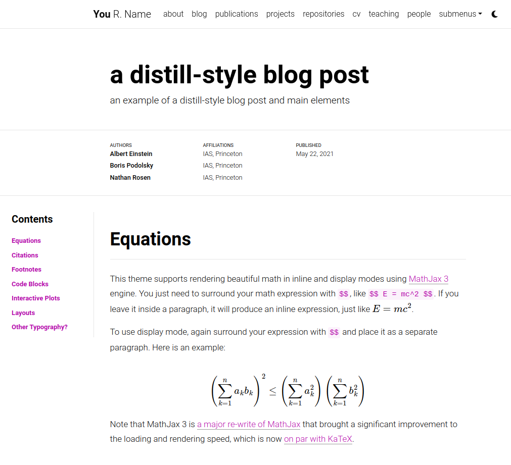](https://alshedivat.github.io/al-folio/blog/2021/distill/)

For more details on how to create distill-styled posts using `<d-*>` tags, please refer to [the example](https://alshedivat.github.io/al-folio/blog/2021/distill/).

#### Full support for math & code

**al-folio** supports fast math typesetting through [MathJax](https://www.mathjax.org/) and code syntax highlighting using [GitHub style](https://github.com/jwarby/jekyll-pygments-themes). Also supports [chartjs charts](https://www.chartjs.org/), [mermaid diagrams](https://mermaid-js.github.io/mermaid/#/), and [TikZ figures](https://tikzjax.com/).

<a href="https://alshedivat.github.io/al-folio/blog/2015/math/" target="_blank">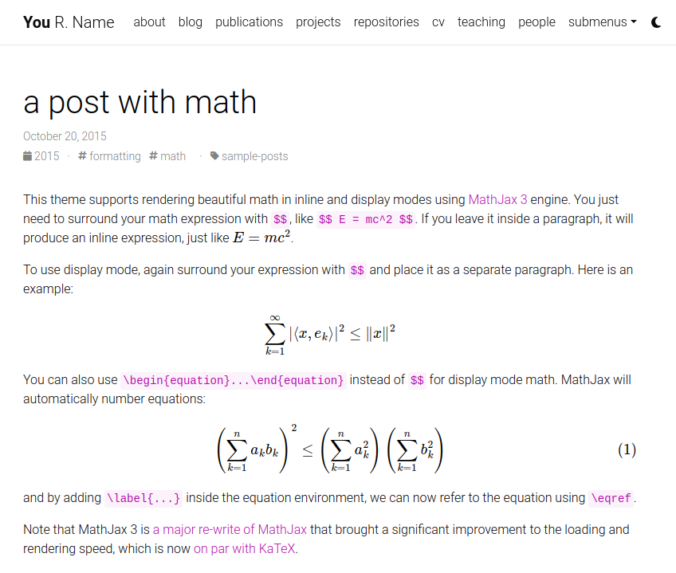</a>
<a href="https://alshedivat.github.io/al-folio/blog/2015/code/" target="_blank">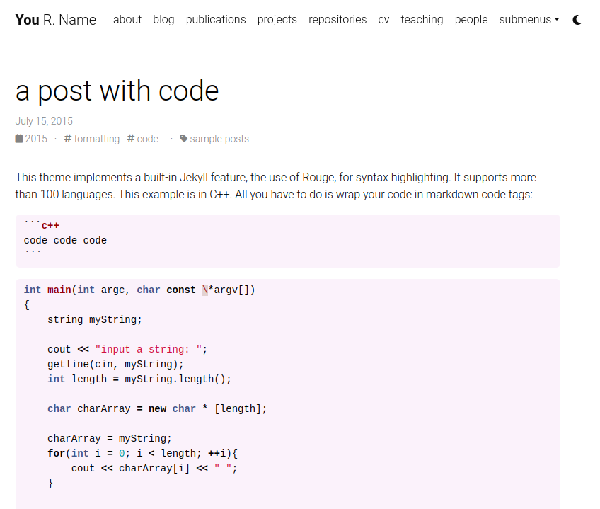</a>

#### Photos, Audio, Video and more

Photo formatting is made simple using Tailwind-first responsive layout utilities. Easily create beautiful grids within your blog posts and project pages, also with support for [video](https://alshedivat.github.io/al-folio/blog/2023/videos/) and [audio](https://alshedivat.github.io/al-folio/blog/2023/audios/) embeds:

  <a href="https://alshedivat.github.io/al-folio/projects/1_project/">
    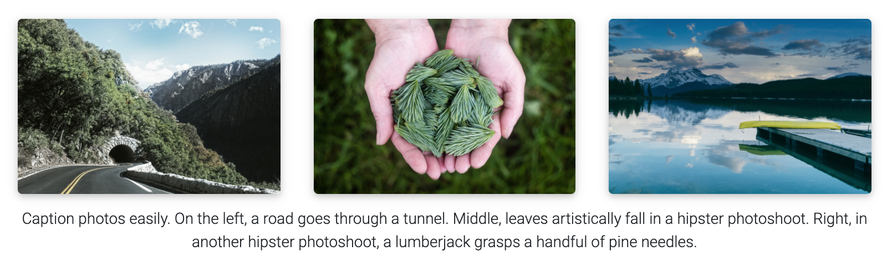
  </a>

---

### Other features

#### GitHub's repositories and user stats

**al-folio** displays GitHub repositories and user stats on the `/repositories/` page using [github-readme-stats](https://github.com/anuraghazra/github-readme-stats) and [github-profile-trophy](https://github.com/ryo-ma/github-profile-trophy).

[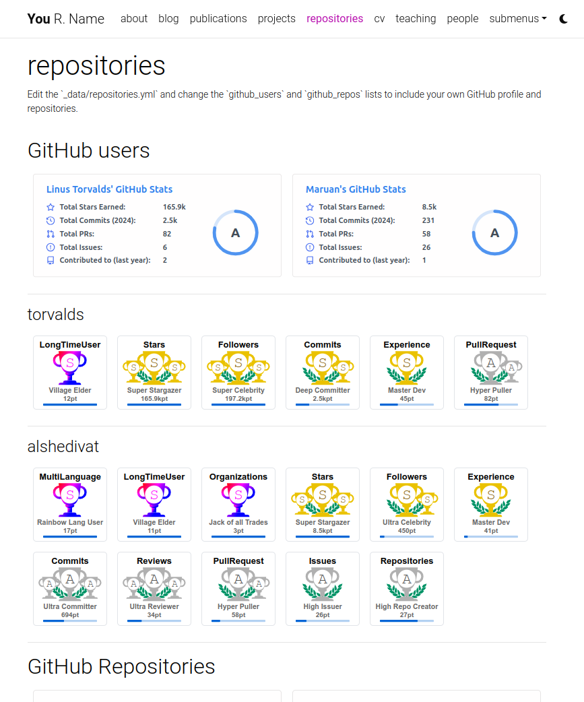](https://alshedivat.github.io/al-folio/repositories/)

To configure which repositories and GitHub profiles to display, see [Modifying the user and repository information](docs/CUSTOMIZE.md#modifying-the-user-and-repository-information) in [docs/CUSTOMIZE.md](docs/CUSTOMIZE.md).

---

#### Theming

**al-folio** offers a variety of beautiful theme colors to choose from. The default is purple, but you can customize colors, fonts, spacing, and more to match your style.

For detailed customization instructions, see [Changing theme color](docs/CUSTOMIZE.md#changing-theme-color) and [Customizing fonts, spacing, and more](docs/CUSTOMIZE.md#customizing-fonts-spacing-and-more) in [docs/CUSTOMIZE.md](docs/CUSTOMIZE.md).

---

#### Social media previews

**al-folio** supports Open Graph preview images on social media. When enabled, your site's pages display rich preview objects with images, titles, and descriptions when shared.

For setup and customization, see [Social media previews](docs/CUSTOMIZE.md#social-media-previews) in [docs/CUSTOMIZE.md](docs/CUSTOMIZE.md).

---

#### Atom (RSS-like) Feed

It generates an Atom (RSS-like) feed of your posts, useful for Atom and RSS readers. The feed is reachable simply by typing after your homepage `/feed.xml`. E.g. assuming your website mountpoint is the main folder, you can type `yourusername.github.io/feed.xml`

---

#### Related posts

By default, blog posts display related posts at the bottom. These are selected by finding the most recent posts that share tags with the current post. You can customize this behavior on a per-post or site-wide basis.

For configuration details, see [Related posts](docs/CUSTOMIZE.md#related-posts) in [docs/CUSTOMIZE.md](docs/CUSTOMIZE.md).

---

#### Code quality checks

Currently, we run some checks to ensure that the code quality and generated site are good. The checks are done using GitHub Actions and the following tools:

- [Prettier](https://prettier.io/) - check if the formatting of the code follows the style guide
- [lychee](https://lychee.cli.rs/) - check for broken links
- [Axe](https://github.com/dequelabs/axe-core) (need to run manually) - do some accessibility testing

We decided to keep `Axe` runs manual because fixing the issues are not straightforward and might be hard for people without web development knowledge.

---

#### GDPR Cookie Consent Dialog

**al-folio** includes a GDPR-compliant cookie consent dialog provided by the `al_cookie` plugin to ensure your website respects visitor privacy. The dialog is powered by [Vanilla Cookie Consent](https://cookieconsent.orestbida.com/) and integrates seamlessly with all supported analytics providers.

When enabled, analytics scripts are blocked until the user explicitly consents, and user preferences are saved across visits. This is essential for websites serving visitors in the European Union and other regions with strict privacy regulations.

For complete setup and customization details, see [GDPR Cookie Consent Dialog](docs/CUSTOMIZE.md#gdpr-cookie-consent-dialog) in [docs/CUSTOMIZE.md](docs/CUSTOMIZE.md).

## FAQ

For frequently asked questions, please refer to [docs/FAQ.md](docs/FAQ.md).

## Contributing

Contributions to al-folio are very welcome! Before you get started, please take a look at [the guidelines](docs/CONTRIBUTING.md).

If you would like to improve documentation or fix a minor inconsistency or bug, please feel free to send a PR directly to `main`. For more complex issues/bugs or feature requests, please open an issue using the appropriate template.

### Maintainers

Our most active contributors are welcome to join the maintainers team. If you are interested, please reach out!

<!-- ALL-CONTRIBUTORS-LIST:START - Do not remove or modify this section -->
<!-- prettier-ignore-start -->
<!-- markdownlint-disable -->
<table>
  <tbody>
    <tr>
      <td align="center" valign="top" width="14.28%"><a href="https://maruan.alshedivat.com"> <b>Maruan</b></a></td>
      <td align="center" valign="top" width="14.28%"><a href="https://rohandebsarkar.github.io"> <b>Rohan Deb Sarkar</b></a></td>
      <td align="center" valign="top" width="14.28%"><a href="https://amirpourmand.ir"> <b>Amir Pourmand</b></a></td>
      <td align="center" valign="top" width="14.28%"><a href="https://george-gca.github.io/"> <b>George</b></a></td>
    </tr>
  </tbody>
</table>

<!-- markdownlint-restore -->
<!-- prettier-ignore-end -->

<!-- ALL-CONTRIBUTORS-LIST:END -->

### All Contributors

## Star History

<a href="https://star-history.com/#alshedivat/al-folio&Date">
  <picture>
    <source media="(prefers-color-scheme: dark)" srcset="https://api.star-history.com/svg?repos=alshedivat/al-folio&type=Date&theme=dark" />
    <source media="(prefers-color-scheme: light)" srcset="https://api.star-history.com/svg?repos=alshedivat/al-folio&type=Date" />
    
  </picture>
</a>

## License

The theme is available as open source under the terms of the [MIT License](https://github.com/alshedivat/al-folio/blob/main/LICENSE).

Originally, **al-folio** was based on the [\*folio theme](https://github.com/bogoli/-folio) (published by [Lia Bogoev](https://liabogoev.com) and under the MIT license). Since then, it got a full re-write of the styles and many additional cool features.
